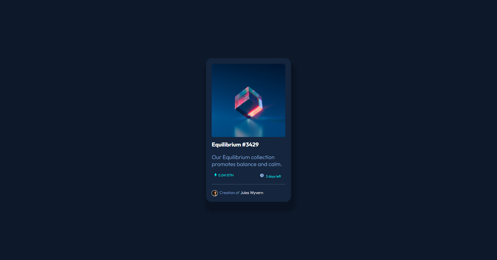

# Frontend Mentor - NFT preview card component solution

This is a solution to the [NFT preview card component challenge on Frontend Mentor](https://www.frontendmentor.io/challenges/nft-preview-card-component-SbdUL_w0U). Frontend Mentor challenges help you improve your coding skills by building realistic projects.

## Table of contents

- [Overview](#overview)
  - [The challenge](#the-challenge)
  - [Screenshot](#screenshot)
  - [Links](#links)
  - [Built with](#built-with)
  - [What I learned](#what-i-learned)
  - [Continued development](#continued-development)
  - [Useful resources](#useful-resources)
- [Author](#author)
- [Acknowledgments](#acknowledgments)

## Overview
A simple layout design with a little challenge (for me) when changing the image hue on hover. 

### The challenge

Users should be able to:

- View the optimal layout depending on their device's screen size
- See hover states for interactive elements

### Screenshot

### Links

- Solution URL: [https://github.com/monicaivanov/NFT-preview-card-component.git]
- Live Site URL: [https://monicaivanov.github.io/NFT-preview-card-component/]

### Built with

- Semantic HTML5 markup
- CSS custom properties
- Flexbox
- CSS Grid

### What I learned
I practiced more the grid and flexbox. I learned how to overlap 2 elements and center them in CSS. I learned to use blend mode property. 

### Continued development
I am still struggling in designing responsive designs especially when starting with mobile first. There are many resources online but they don't always fit the actual needs and I struglle to understand how my choice of properties/values is influencing each other. 

### Useful resources

No specific resources were used. For values search of the CSS properties I used w3school and mdn web docs. I used web.dev as a guide for responsive design and semantic HTML. 

## Author

- Frontend Mentor - [@monicaivanov](https://www.frontendmentor.io/profile/monicaivanov)

